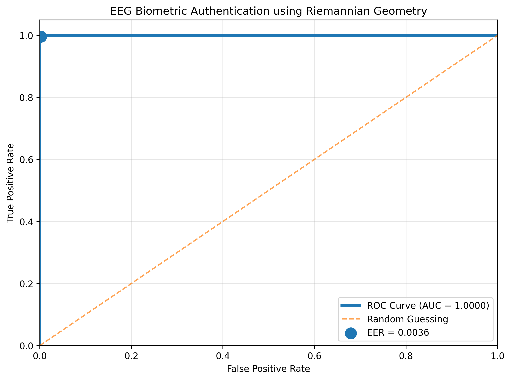

# EEG Biometric Authentication with Riemannian Geometry

## Overview

This project builds an EEG-based biometric authentication system using covariance features and Riemannian geometry.

The goal is to test whether neural activity patterns can serve as a subject-specific identity signature.

Unlike a standard EEG classifier, this project is framed as an authentication system:

- Genuine attempt: a subject claims their own identity.
- Impostor attempt: a subject claims someone else's identity.
- The system accepts or rejects the attempt based on Riemannian distance to an enrolled neural template.

## Research Question

Can EEG covariance structure be used as a biometric fingerprint for subject identity verification?

## Dataset

- Dataset: EEG Motor Movement/Imagery Dataset
- Subjects: 9
- Runs: 4, 8, 12
- Task: Left-hand and right-hand motor imagery
- Modality: EEG
- Channels: 64 scalp electrodes
- Sampling frequency: 160 Hz

## Results

| Metric | Value |
|--------|-------|
| AUC | 0.99999 |
| Equal Error Rate (EER) | 0.0036 |
| Subjects | 9 |
| Authentication Method | Riemannian Distance |
| Covariance Estimator | OAS |

The authentication system achieved near-perfect separation between genuine and impostor authentication attempts under same-session evaluation conditions.

The extremely low Equal Error Rate suggests that covariance structure in motor imagery EEG contains highly subject-specific information that can serve as a neural biometric signature.

## ROC Curve



## Pipeline

```text
Raw EEG
↓
8–30 Hz bandpass filtering
↓
Event extraction
↓
Epoching
↓
Covariance matrix estimation
↓
Riemannian subject template
↓
Riemannian distance scoring
↓
Threshold-based accept/reject decision
↓
ROC / AUC / EER evaluation
